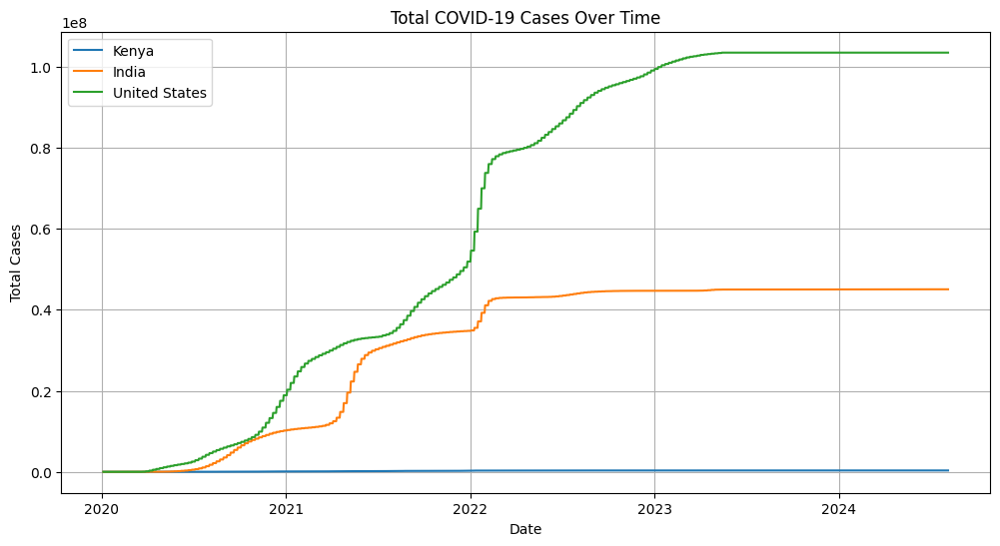
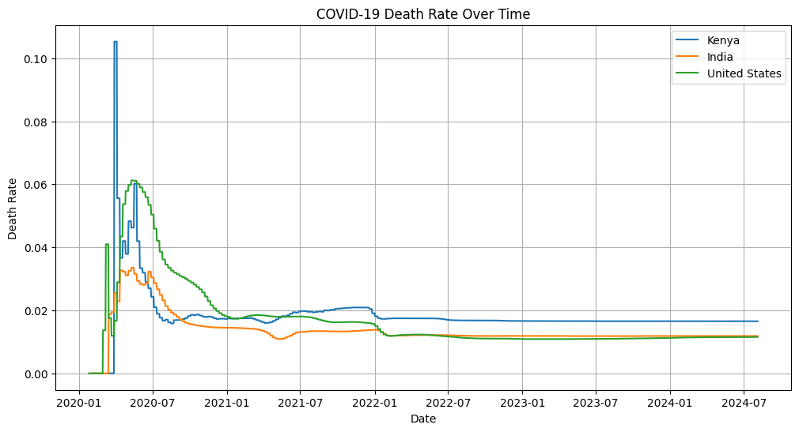
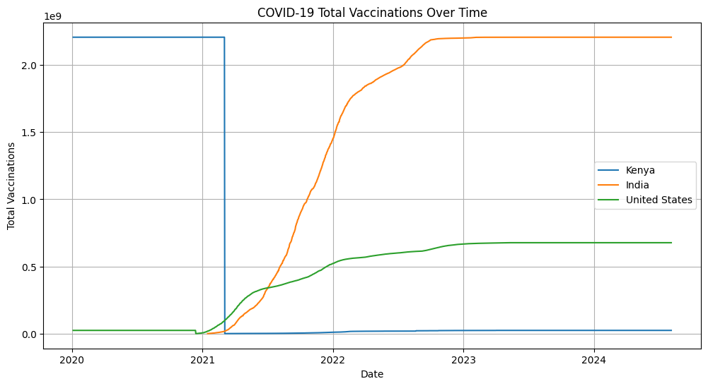
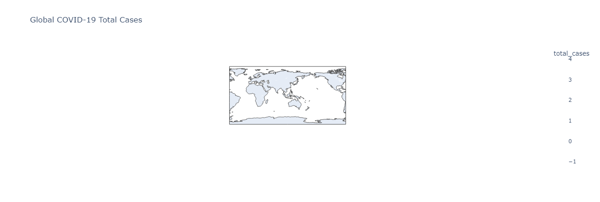

# COVID-19 Global Data Tracker

## Overview
The **COVID-19 Global Data Tracker** is a Python-based project that visualizes and analyzes global COVID-19 data. It uses the **Our World in Data (OWID)** dataset to provide insights into cases, deaths, vaccinations, and other key metrics.

## Features
- **Data Collection**: Automatically loads the OWID dataset (`owid-covid-data.csv`).
- **Data Visualization**:
  - Total cases, deaths, and vaccinations over time.
  - Daily new cases and death rates for selected countries.
  - Choropleth maps for global COVID-19 metrics.
- **Analysis**:
  - Death rate trends.
  - Vaccination progress across countries.

## Project Structure
- `COVID19_Global_Data_Tracker.ipynb`: Jupyter Notebook containing the code for data loading, analysis, and visualization.
- `owid-covid-data.csv`: Dataset file containing global COVID-19 data.
- `README.md`: Documentation for the project.

## Data Source
The project uses the **Our World in Data (OWID)** dataset. You can download the dataset from:
[https://covid.ourworldindata.org/data/owid-covid-data.csv](https://covid.ourworldindata.org/data/owid-covid-data.csv)

## How to Run
1. Clone the repository and navigate to the project directory.
2. Ensure you have Python installed along with the required libraries:
   ```sh
   pip install pandas matplotlib seaborn plotly
3. Open the COVID19_Global_Data_Tracker.ipynb file in Jupyter Notebook or any compatible IDE.
4. Run the cells sequentially to load the data, analyze it, and generate visualizations.


## Visualizations
## The project generates the following visualizations:

### 1. Total Cases Over Time: Line plot showing cumulative cases for selected countries.


### 2. Daily New Cases: Line plot showing daily new cases for selected countries.


### 3. Death Rate Over Time: Line plot showing the death rate for selected countries.


### 4. Total Vaccinations Over Time: Line plot showing cumulative vaccinations for selected countries.


### 5. Choropleth Map: Interactive map visualizing global COVID-19 metrics.


## Requirements
- Python 3.x
- Libraries: pandas, matplotlib, seaborn, plotly


## Example Code
## Loading the Dataset

```
import pandas as pd

df = pd.read_csv('owid-covid-data.csv')

print(df.head())
```

## Visualizing Total Cases Over Time
# Total cases over time

```
import matplotlib.pyplot as plt
plt.figure(figsize=(12, 6))
for country in countries:
    data = df_filtered[df_filtered['location'] == country]
    plt.plot(data['date'], data['total_cases'], label=country)
plt.title('Total COVID-19 Cases Over Time')
plt.xlabel('Date')
plt.ylabel('Total Cases')
plt.legend()
plt.grid()
plt.show()
``` 

## Acknowledgments
- Our World in Data for providing the dataset.
- Libraries used: pandas, matplotlib, seaborn, plotly.